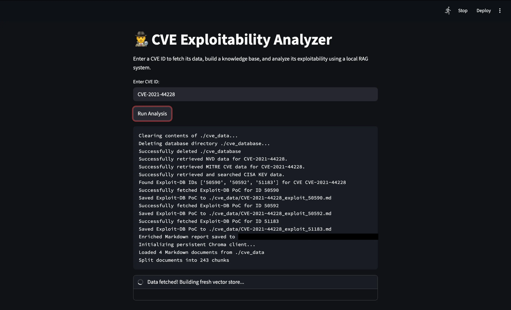
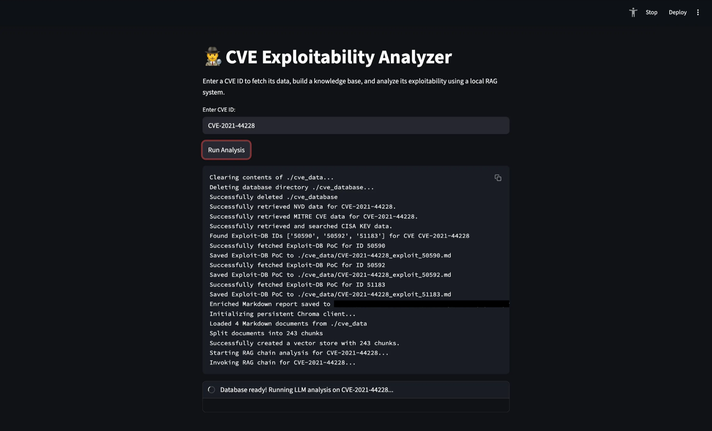
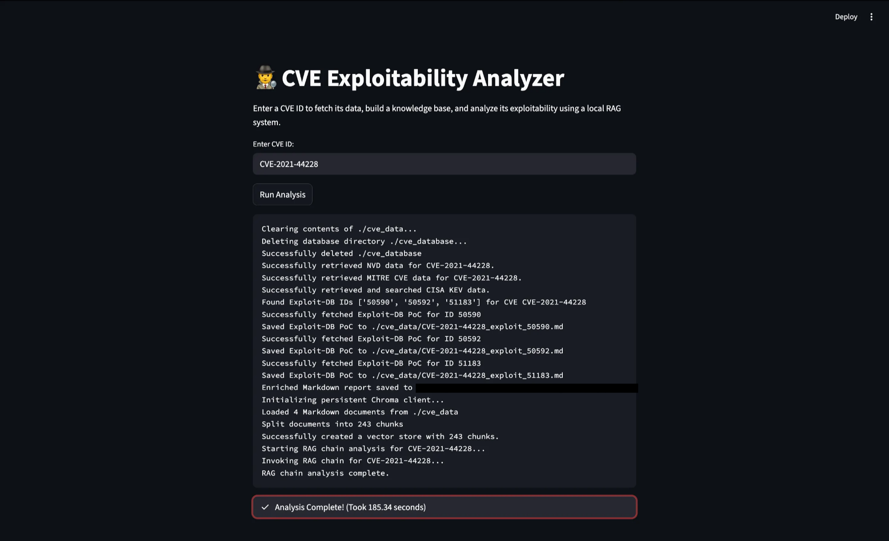
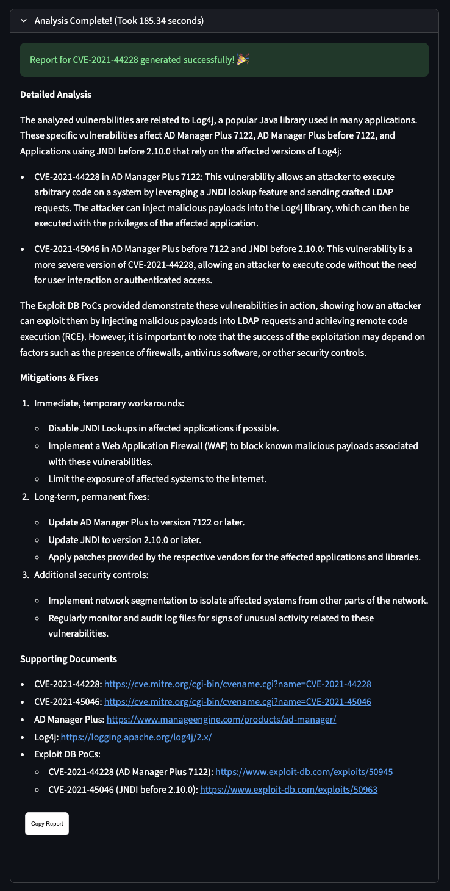

| Version | Updated on | Updated by |
| :--- | :--- | :--- |
| v1.0.0 | 10/09/2025 | @crxso |

## Project Goal

The **Local CVE Exploitability Analyzer** project implements an automated system for assessing the exploitability of Common Vulnerabilities and Exposures (CVEs). 

The core functionality is built upon a **Retrieval-Augmented Generation (RAG)** architecture using two local components:
* Ollama for the Language Model (LLM) and embeddings
* ChromaDB for the vector store; emulating the multi-LLM agentic framework described in the project plan.

The objective is to develop an automated system for assessing the exploitability of Common Vulnerabilities and Exposures (CVEs). The system uses a multi-LLM agentic framework to perform comprehensive analysis and provide a clear, actionable "proof of exploitability" score or narrative. The ultimate goal is to move beyond simple vulnerability detection to a proactive, threat-informed security posture.

---

## Methodology & Technical Approach

The system leverages an agentic AI framework where multiple specialized LLMs (agents) work together under a central orchestration layer. This approach deconstructs the CVE analysis into specialized functions, minimizing the risk of hallucination and allowing for targeted fine-tuning and debugging.

### Agent Roles & Responsibilities (Implemented in `run_system.py`)

The three conceptual agents are functionally implemented within the logic of `run_system.py` and the RAG chain's prompt structure:

* **Data Retrieval Agent:** Implemented by the **`fetch_and_save_cve`** function in `run_system.py`. It is responsible for retrieving all relevant CVE information from external sources like **NVD** and **MITRE** and gathering exploitation evidence from **CISA KEV** and **Exploit-DB**. The fetched data is saved locally and forms the **LocalGPT RAG knowledge base**.

* **Vulnerability Analysis Agent:** The first stage of the **`run_rag_chain`** in `run_system.py`, where the LLM's **Chain of Thought (Steps 1-3)** analyzes the data retrieved from the vector store to interpret the vulnerability's nature, root cause, and potential impact.

* **Exploit Assessment Agent:** The second stage of the **`run_rag_chain`** in `run_system.py`, where the LLM's **Chain of Thought (Steps 4-7)** synthesizes the analysis, evaluates exploitability based on PoC code, and determines the final **Verdict** and **Mitigations & Fixes**.

---

## Core Program Descriptions

The system consists of two main programs: the backend analysis engine (`run_system.py`) and the frontend web application (`app.py`).

### `run_system.py`: The RAG Engine

This Python script is the **backend analysis engine** and RAG implementation. It handles all data ingestion, vector store management, and the final LLM-based analysis.

| Function | Description | Conceptual Agent Role |
| :--- | :--- | :--- |
| <span style="white-space: nowrap;"> **`clear_data_directory`** </span> | Clears the previous run's fetched data (`cve_data`) and the vector database (`cve_database`) to ensure a fresh, specific analysis. | Orchestration Layer |
| <span style="white-space: nowrap;"> **`fetch_exploit_db_id`** </span> | Searches the Exploit-DB website to find associated exploit IDs for the target CVE. | Data Retrieval Agent |
| <span style="white-space: nowrap;"> **`fetch_exploit_db_poc`** </span> | Fetches the raw Proof-of-Concept (PoC) code from Exploit-DB using the retrieved ID. | Data Retrieval Agent |
| <span style="white-space: nowrap;"> **`fetch_and_save_cve`** </span> | Fetches vulnerability data from **NVD**, **MITRE**, and **CISA KEV**. It compiles this data, along with any Exploit-DB PoCs, into Markdown files and saves them to the `cve_data` directory. | Data Retrieval Agent |
| <span style="white-space: nowrap;"> **`build_vector_store`** </span> | Initializes the **ChromaDB** client, loads the Markdown files from `cve_data`, chunks them using **`RecursiveCharacterTextSplitter`**, and embeds the chunks using **`OllamaEmbeddings`** (`nomic-embed-text`) to create the RAG knowledge base. | Orchestration Layer / RAG Setup |
| <span style="white-space: nowrap;"> **`run_rag_chain`** </span> | This is the core analysis function. It sets up the RAG pipeline using **LangChain**: it retrieves relevant document chunks from the vector store and passes them, along with the Exploit-DB PoCs, to the **Ollama LLM** (`mistral:instruct`) with a detailed, structured prompt for generating the final analysis report. | Analysis Agent & Exploit Assessment Agent |


```python
# run_system.py
#!/usr/bin/env python3

import json
import os
import requests
import chromadb
from langchain_community.document_loaders import DirectoryLoader
from langchain.text_splitter import RecursiveCharacterTextSplitter
from langchain_community.vectorstores import Chroma
from langchain_ollama import OllamaEmbeddings, OllamaLLM
from langchain.prompts import PromptTemplate
from langchain_core.runnables import RunnablePassthrough, RunnableLambda
import argparse
import shutil
import time
import traceback

NVD_API_KEY = "redacted"
DATA_DIR = "./cve_data"
DB_PATH = "./cve_database"
COLLECTION_NAME = "cve_collection"

def clear_data_directory(logger=None):
    if os.path.exists(DATA_DIR):
        if logger:
            logger(f"Clearing contents of {DATA_DIR}...")
        for filename in os.listdir(DATA_DIR):
            file_path = os.path.join(DATA_DIR, filename)
            try:
                if os.path.isfile(file_path) or os.path.islink(file_path):
                    os.unlink(file_path)
                elif os.path.isdir(file_path):
                    shutil.rmtree(file_path)
            except Exception as e:
                if logger:
                    logger(f"Failed to delete {file_path}. Reason: {e}")
    else:
        os.makedirs(DATA_DIR, exist_ok=True)
        if logger:
            logger(f"Created data directory: {DATA_DIR}")

    if os.path.exists(DB_PATH):
        try:
            if logger:
                logger(f"Deleting database directory {DB_PATH}...")
            shutil.rmtree(DB_PATH)
            if logger:
                logger(f"Successfully deleted {DB_PATH}")
        except Exception as e:
            if logger:
                logger(f"Failed to delete database directory {DB_PATH}. Reason: {e}")
    else:
        if logger:
            logger(f"Database directory {DB_PATH} does not exist, skipping deletion.")

def fetch_exploit_db_id(cve_id, logger=None):
    search_url = f"[https://www.exploit-db.com/search?cve=](https://www.exploit-db.com/search?cve=){cve_id}"
    headers = {
        "Accept": "application/json, text/javascript, */*; q=0.01",
        "X-Requested-With": "XMLHttpRequest",
        "User-Agent": "Mozilla/5.0 (Windows NT 10.0; Win64; x64) "
                      "AppleWebKit/537.36 (KHTML, like Gecko) "
                      "Chrome/115.0.0.0 Safari/537.36",
        "Referer": "[https://www.exploit-db.com/](https://www.exploit-db.com/)",
    }
    try:
        response = requests.get(search_url, headers=headers)
        response.raise_for_status()
        data = response.json()
        if data.get("recordsTotal", 0) > 0 and data.get("data"):
            exploit_ids = [item["id"] for item in data["data"]]
            if logger:
                logger(f"Found Exploit-DB IDs {exploit_ids} for CVE {cve_id}")
            return exploit_ids
        else:
            if logger:
                logger(f"No Exploit-DB entries found for CVE {cve_id}")
            return []
    except Exception as e:
        if logger:
            logger(f"Failed to fetch Exploit-DB ID: {e}")
        return []

def fetch_exploit_db_poc(exploit_id, logger=None):
    raw_url = f"[https://www.exploit-db.com/raw/](https://www.exploit-db.com/raw/){exploit_id}"
    headers = {
        "User-Agent": "Mozilla/5.0 (Windows NT 10.0; Win64; x64) "
                      "AppleWebKit/537.36 (KHTML, like Gecko) "
                      "Chrome/115.0.0.0 Safari/537.36"
    }
    try:
        response = requests.get(raw_url, headers=headers)
        response.raise_for_status()
        if logger:
            logger(f"Successfully fetched Exploit-DB PoC for ID {exploit_id}")
        return response.text
    except Exception as e:
        if logger:
            logger(f"Failed to fetch Exploit-DB PoC: {e}")
        return None

def fetch_and_save_cve(cve_id, nvd_api_key, logger=None):
    url = "[https://services.nvd.nist.gov/rest/json/cves/2.0](https://services.nvd.nist.gov/rest/json/cves/2.0)"
    params = {"cveId": cve_id}
    headers = {"apiKey": nvd_api_key}

    nvd_data = {}
    cve_info = None

    try:
        response = requests.get(url, headers=headers, params=params)
        response.raise_for_status()
        nvd_data = response.json()

        vulns = nvd_data.get("vulnerabilities", [])
        if not vulns:
            if logger:
                logger(f"No NVD data found for {cve_id}. Skipping.")
            return False, [], []

        cve_info = vulns[0].get("cve", {})
        if logger:
            logger(f"Successfully retrieved NVD data for {cve_id}.")
    except Exception as e:
        if logger:
            logger(f"Failed to fetch NVD data: {e}")
        return False, [], []

    cisa_kev_data = {}
    mitre_cve_data = {}

    try:
        mitre_url = f"[https://cveawg.mitre.org/api/cve/](https://cveawg.mitre.org/api/cve/){cve_id}"
        mitre_response = requests.get(mitre_url)
        mitre_response.raise_for_status()
        mitre_cve_data = mitre_response.json()
        if logger:
            logger(f"Successfully retrieved MITRE CVE data for {cve_id}.")
    except Exception as e:
        if logger:
            logger(f"Failed to fetch MITRE CVE data: {e}")

    try:
        cisa_url = "[https://www.cisa.gov/sites/default/files/feeds/known_exploited_vulnerabilities.json](https://www.cisa.gov/sites/default/files/feeds/known_exploited_vulnerabilities.json)"
        cisa_response = requests.get(cisa_url)
        cisa_response.raise_for_status()
        cisa_kev_feed = cisa_response.json()

        cisa_kev_data['is_kev_exploited'] = any(
            item['cveID'] == cve_id for item in cisa_kev_feed.get('vulnerabilities', [])
        )
        if logger:
            logger(f"Successfully retrieved and searched CISA KEV data.")
    except Exception as e:
        if logger:
            logger(f"Failed to fetch CISA KEV data: {e}")
        cisa_kev_data['is_kev_exploited'] = False

    exploit_db_ids = fetch_exploit_db_id(cve_id, logger=logger)
    exploit_db_pocs = []
    for eid in exploit_db_ids:
        poc = fetch_exploit_db_poc(eid, logger=logger)
        if poc:
            exploit_db_pocs.append((eid, poc))
            poc_filename = os.path.join(DATA_DIR, f"{cve_id}_exploit_{eid}.md")
            with open(poc_filename, "w", encoding="utf-8") as f:
                f.write(f"# Exploit DB PoC for {cve_id} - Exploit ID {eid}\n\n")
                f.write("```text\n")
                f.write(poc)
                f.write("\n```\n")
            if logger:
                logger(f"Saved Exploit-DB PoC to {poc_filename}")
        time.sleep(0.5)

    descriptions = cve_info.get("descriptions", [])
    description = descriptions[0]["value"] if descriptions else "No description available"
    md_content = f"# CVE Report: {cve_id}\n\n"
    md_content += f"## NVD Description\n\n{description}\n\n"
    is_kev_exploited = cisa_kev_data.get('is_kev_exploited', False)
    md_content += f"**Active Exploitation (CISA KEV):** {'Yes' if is_kev_exploited else 'No'}\n\n"
    cvss_metrics_v4 = cve_info.get("metrics", {}).get("cvssMetricV40", [])
    cvss_metrics_v3 = cve_info.get("metrics", {}).get("cvssMetricV31", [])
    if cvss_metrics_v4:
        cvss = cvss_metrics_v4[0].get("cvssData", {})
        md_content += f"**CVSS v4 Base Score:** {cvss.get('baseScore', 'N/A')}  \n"
        md_content += f"**CVSS v4 Base Severity:** {cvss.get('baseSeverity', 'N/A')}\n\n"
    elif cvss_metrics_v3:
        cvss = cvss_metrics_v3[0].get("cvssData", {})
        md_content += f"**CVSS v3.1 Base Score:** {cvss.get('baseScore', 'N/A')}  \n"
        md_content += f"**CVSS v3.1 Base Severity:** {cvss.get('baseSeverity', 'N/A')}\n\n"
    md_content += "---\n\n"
    md_content += "## Full NVD JSON Response\n\n"
    md_content += f"```json\n{json.dumps(nvd_data, indent=2)}\n```\n\n"
    md_content += "---\n\n"
    md_content += "## MITRE CVE Information\n\n"
    md_content += f"```json\n{json.dumps(mitre_cve_data, indent=2)}\n```\n\n"

    os.makedirs(os.path.join(os.getcwd(), 'cve_data'), exist_ok=True)
    md_filename = os.path.join(os.getcwd(), 'cve_data', f"{cve_id}.md")
    with open(md_filename, "w", encoding="utf-8") as md_file:
        md_file.write(md_content)
    if logger:
        logger(f"Enriched Markdown report saved to {md_filename}")

    return True, exploit_db_ids, exploit_db_pocs

def build_vector_store(logger=None):
    try:
        if logger:
            logger("Initializing persistent Chroma client...")
        client = chromadb.PersistentClient(path=DB_PATH)
        embeddings = OllamaEmbeddings(model="nomic-embed-text")

        loader = DirectoryLoader(DATA_DIR, glob="*.md")
        documents = loader.load()
        if logger:
            logger(f"Loaded {len(documents)} Markdown documents from {DATA_DIR}")

        text_splitter = RecursiveCharacterTextSplitter(chunk_size=1000, chunk_overlap=200)
        chunks = text_splitter.split_documents(documents)
        if logger:
            logger(f"Split documents into {len(chunks)} chunks")

        db = Chroma.from_documents(
            documents=chunks,
            embedding=embeddings,
            client=client,
            collection_name=COLLECTION_NAME
        )
        if logger:
            logger(f"Successfully created a vector store with {len(chunks)} chunks.")
        return db

    except Exception as e:
        if logger:
            logger(f"Failed to build vector store: {e}")
        return None

def run_rag_chain(db, cve_id_to_analyze, exploit_db_pocs=None, logger=None):
    try:
        if logger:
            logger(f"Starting RAG chain analysis for {cve_id_to_analyze}...")
        llm = OllamaLLM(model="mistral:instruct")
        retriever = db.as_retriever()

        def escape_braces(text):
            return text.replace("{", "{{").replace("}", "}}")

        if exploit_db_pocs and len(exploit_db_pocs) > 0:
            exploit_pocs_text = "\n\n".join(
                [f"### Exploit ID: {eid}\n```text\n{escape_braces(poc)}\n```" for eid, poc in exploit_db_pocs]
            )
        else:
            exploit_pocs_text = "No public exploit proof-of-concept code found."

        prompt_template = PromptTemplate(
            template=f"""
        # {cve_id_to_analyze} Exploitability Analysis Report

        ### Context
        Based ONLY on the following context, perform a comprehensive exploitability analysis of the provided CVE. All findings and conclusions MUST be supported by this context. Do not use any external knowledge.

        {{{{context}}}}

        ### Role
        You are a Expert Level - Senior Penetration Engineer. Your role is to perform a detailed exploitability analysis and impact assessment of the CVE. You are to produce a report that is technical, exhaustive in its detail, comprehensive, and provides clear, actionable guidance on fixes and mitigations.

        ### Instructions
        Analyze the provided CVE. Your task is to generate a detailed, multi-section report in Markdown format.
        You MUST follow a step-by-step analytical process before writing the report.
        You MUST provide a clear, concise, and elaborate summary of the CVE and its exploitability status.
        You MUST include a dedicated section for mitigations and fixes.
        You MUST adhere to the formatting and structure specified in the 'Expectation' section.

        # New Constraint Added Here
        You MUST NOT include any conversational introduction, preamble, or any sentences that refer to the report itself. Start directly with the markdown heading for the CVE.

        ### Steps (Chain of Thought)
        BEFORE generating your final report, think step-by-step through the following logical process:
        1. Review the provided context and identify the core vulnerability type and its root cause.
        2. Assess the vulnerability's potential impact and severity based on the provided CVSS score.
        3. Cross-reference the CVE with CISA's Known Exploited Vulnerabilities (KEV) catalog. If active exploitation is mentioned, make a specific note of this.
        4. Search for and evaluate evidence of public exploits or proof-of-concept (PoC) code, including the Exploit DB PoCs provided. Consider the reliability and maturity of these exploits.
        5. Synthesize all data points (root cause, CVSS, exploitation evidence, Exploit DB PoCs) to determine the final exploitability verdict: "Critical", "High", "Medium", "Low", or "Unconfirmed".
        6. Based on your analysis, propose a clear, prioritized set of mitigations, including temporary workarounds and long-term fixes.
        7. Formulate a final verdict and a high-level summary that captures the essence of your detailed analysis.

        ### Expectation
        Your final output MUST be a well-formatted Markdown document with the following exact structure and headings. Each section must be detailed and comprehensive.

        ## **Summary**
        A detailed and elaborate summary of the CVE, its technical nature, and a clear explanation of its exploitability status. Include the range of affected version(s) if there exist a number, list, or range.

        ## **Verdict**
        The final verdict on the exploitability status: "Critical", "High", "Medium", "Low", or "Unconfirmed".

        ## **Key Findings**
        A bulleted list highlighting crucial data points from your analysis:
        * **Active Exploitation:** State "Yes (from CISA KEV)" or "No (from CISA KEV)" or "Not Available."
        * **CVSS Score:** State the full score string (e.g., CVSS 3.1: 8.9) or "Not Available."
        * **Public Exploits:** State "Confirmed," "Unconfirmed," or "Not Available."

        ## Exploit Proof of Concept(s)
        The following Exploit-DB PoCs are associated with this CVE and MUST be included verbatim in the report:

        {exploit_pocs_text}

        ## **Detailed Analysis**
        A multi-paragraph section that explains the technical details of the vulnerability, how it can be exploited, and the factors that contribute to its exploitability verdict. Include your assessment of the Exploit DB PoCs.

        ## **Mitigations & Fixes**
        A comprehensive list of recommended actions to mitigate or fix the vulnerability. This must include:
        * Immediate, temporary workarounds.
        * Long-term, permanent fixes (e.g., patching).
        * Any additional security controls (e.g., WAF rules, network segmentation).

        ## **Supporting Documents**
        A bulleted list of the documents and sources used for your analysis.
        """,
            input_variables=["context", "cve_id"],
        )

        rag_chain = (
            {
                "context": RunnableLambda(lambda x: retriever.invoke("CVE Report: " + x['cve_id'])),
                "cve_id": RunnablePassthrough()
            }
            | prompt_template
            | llm
        )

        if logger:
            logger(f"Invoking RAG chain for {cve_id_to_analyze}...")
        markdown_report = rag_chain.invoke({"cve_id": cve_id_to_analyze})

        if logger:
            logger("RAG chain analysis complete.")
        return markdown_report

    except Exception as e:
        if logger:
            logger(f"An error occurred during the RAG process: {e}")
            logger(traceback.format_exc())
        return "Analysis failed."

def main():
    def log(msg):
        print(msg)

    parser = argparse.ArgumentParser(description="Analyze a CVE using RAG.")
    parser.add_argument("--cve", type=str, required=True, help="The CVE ID to analyze.")
    args = parser.parse_args()

    cve_to_analyze = args.cve

    success, exploit_ids, exploit_db_pocs = fetch_and_save_cve(cve_to_analyze, NVD_API_KEY, logger=log)
    if success:
        db = build_vector_store(logger=log)
        if db:
            run_rag_chain(db, cve_to_analyze, exploit_db_pocs=exploit_db_pocs, logger=log)
    else:
        print("Stopping script due to data retrieval failure.")

if __name__ == "__main__":
    main()
```

---

### `app.py`: The Streamlit Frontend

This script provides the **Orchestration Layer** interface for the user. It uses **Streamlit** to create a simple web application that allows users to input a CVE ID and initiate the full analysis pipeline.

* **User Interface (UI):** Provides a clean input field for the CVE ID and a "Run Analysis" button.

* **Workflow Orchestration:** It imports and sequentially calls the core functions from `run_system.py`: `clear_data_directory`, `fetch_and_save_cve`, `build_vector_store`, and `run_rag_chain`.

* **Logging and Status:** It uses a real-time status container to log the progress of each step (e.g., fetching data, building DB, running LLM), giving the user visibility into the backend process.

* **Result Presentation:** Upon completion, it renders the final Markdown report generated by the RAG chain and includes a "Copy Report" button.

```python
# app.py

import streamlit as st
import time
import json
import os
import sys
import re
from st_copy_to_clipboard import st_copy_to_clipboard
import chromadb
from langchain_ollama import OllamaEmbeddings
from langchain_community.vectorstores import Chroma

from run_system import (
    fetch_and_save_cve,
    build_vector_store,
    run_rag_chain,
    clear_data_directory,
    NVD_API_KEY,
    DB_PATH,
    COLLECTION_NAME
)

def clean_llm_output(text):
    return re.sub(r'^`{1,}|`{1,}$', '', text.strip()).strip()

st.set_page_config(
    page_title="Local CVE Exploitability Analyzer",
    page_icon="🕵️‍♂️",
    layout="centered"
)

st.title("🕵️‍♂️ CVE Exploitability Analyzer")

st.write(
    "Enter a CVE ID to fetch its data, build a knowledge base, and analyze its exploitability using a local RAG system."
)

cve_id_input = st.text_input(
    "Enter CVE ID:",
    placeholder="CVE-YYYY-NNNN"
)

if st.button("Run Analysis"):
    if not cve_id_input:
        st.error("Please enter a CVE ID.")
    else:
        start_time = time.time()
        log_lines = []  # fresh log lines for this run

        # Create logs container BEFORE defining log()
        logs_display = st.empty()

        def log(msg):
            log_lines.append(msg)
            logs_display.code("\n".join(log_lines), language="text")

        with st.status(f"Analyzing {cve_id_input}...", expanded=True, state="running") as status:
            status.update(label=f"Clearing old data...", state="running")
            clear_data_directory(logger=log)

            status.update(label=f"Fetching data for {cve_id_input}...", state="running")
            fetch_success, exploit_ids, exploit_db_pocs = fetch_and_save_cve(cve_id_input, NVD_API_KEY, logger=log)
            if not fetch_success:
                status.update(label=f"Failed to fetch data for {cve_id_input}.", state="error")
                st.error("Failed to fetch CVE data. Please check the CVE ID.")
                st.stop()

            status.update(label=f"Data fetched! Building fresh vector store...", state="running")
            db = build_vector_store(logger=log)
            if not db:
                status.update(label="Failed to initialize vector store.", state="error")
                st.error("Vector store could not be initialized.")
                st.stop()

            status.update(label=f"Database ready! Running LLM analysis on {cve_id_input}...", state="running")
            report_output = run_rag_chain(db, cve_id_input, exploit_db_pocs=exploit_db_pocs, logger=log)

            if report_output and "Analysis failed" not in report_output:
                clean_report = clean_llm_output(report_output)
                elapsed_time = time.time() - start_time
                status.update(label=f"Analysis Complete! (Took {elapsed_time:.2f} seconds)", state="complete", expanded=False)
                st.success(f"Report for {cve_id_input} generated successfully! 🎉")
                st.markdown(clean_report)
                st_copy_to_clipboard(clean_report, "Copy Report")
            else:
                status.update(label="An error occurred during analysis.", state="error")
                st.error("An error occurred during the LLM analysis.")
```

## Program Interaction Flow

The two programs work together in a tightly coupled client-server-like model, where `app.py` acts as the orchestrator and client, and `run_system.py` provides the underlying analytical services.

1.  **User Initiates Analysis:** The user enters a CVE ID in the `app.py` Streamlit interface and clicks "Run Analysis."

2.  **Orchestration (app.py):** `app.py` begins the process, managing the status display and logs.

3.  **Data Cleanup & Retrieval (run\_system.py via app.py):** `app.py` calls `clear_data_directory` to ensure a clean state, followed by `fetch_and_save_cve` to gather data from NVD, MITRE, CISA, and Exploit-DB, storing it in the `cve_data` directory.

4.  **Knowledge Base Build (run\_system.py via app.py):** `app.py` calls `build_vector_store`, which reads the new Markdown files, chunks them, embeds them, and stores the vectors in the `cve_database` (ChromaDB).

5.  **LLM Analysis (run\_system.py via app.py):** `app.py` calls the core RAG function, `run_rag_chain`. This function uses the new vector store for context, queries the Ollama LLM (`mistral:instruct`), and returns the final, structured Markdown report.

6.  **Report Display (app.py):** `app.py` receives the Markdown report, cleans it, and renders it directly in the Streamlit application for the user.

---

## Results & Outputs

### Template Terminal/Streamlit Log Output

```text
Clearing contents of ./cve_data...
Deleting database directory ./cve_database...
Successfully deleted ./cve_database
Successfully retrieved NVD data for CVE-YYYY-NNNN.
Successfully retrieved MITRE CVE data for CVE-YYYY-NNNN.
Successfully retrieved and searched CISA KEV data.
Found Exploit-DB IDs ['XXXXX', 'YYYYY'] for CVE CVE-YYYY-NNNN
Successfully fetched Exploit-DB PoC for ID XXXXX
Saved Exploit-DB PoC to ./cve_data/CVE-YYYY-NNNN_exploit_XXXXX.md
Successfully fetched Exploit-DB PoC for ID YYYYY
Saved Exploit-DB PoC to ./cve_data/CVE-YYYY-NNNN_exploit_YYYYY.md
Enriched Markdown report saved to /path/to/cve-explpoit-proj/cve_data/CVE-YYYY-NNNN.md
Initializing persistent Chroma client...
Loaded 3 Markdown documents from ./cve_data
Split documents into 12 chunks
Successfully created a vector store with 12 chunks.
Starting RAG chain analysis for CVE-YYYY-NNNN...
Invoking RAG chain for CVE-YYYY-NNNN...
RAG chain analysis complete.
```
### Real Terminal/Streamlit Log Output







