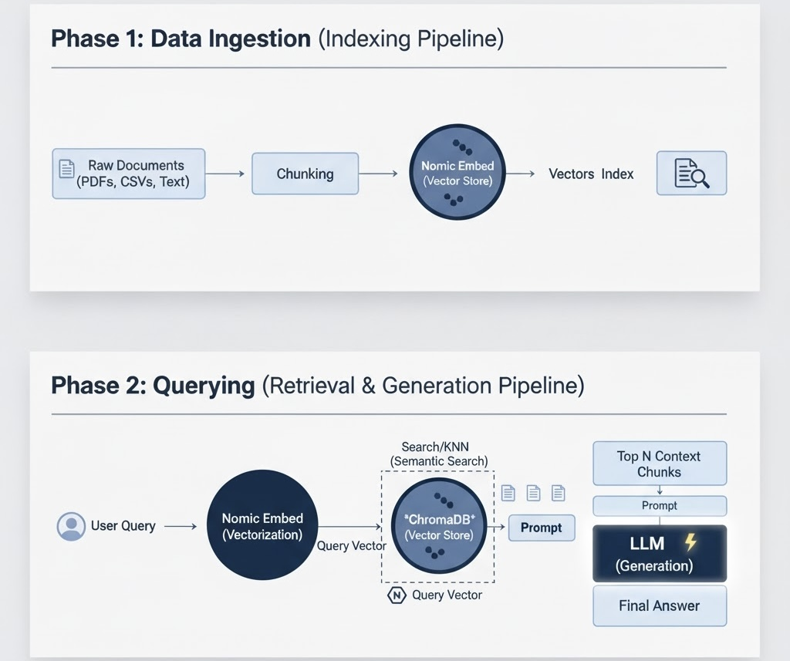

# Approach to Retrieval-Augmented Generation (RAG)

| Version | Updated on | Updated by |
| :--- | :--- | :--- |
| v1.0.0 | 10/03/2025 | @crxso |

## RAG Structure

**Retrieval-Augmented Generation (RAG)** is a technique that uses Large Language Models (LLMs) with external, proprietary knowledge to improve accuracy and reduce "**hallucination**". The success of any RAG system relies entirely on its ability to quickly and accurately retrieve relevant context from a knowledge base.

* **Hallucination** is a phenomenon where the LLM generates a response that is plausible-sounding and fluent but is factually incorrect, nonsensical, or unfaithful to the source information.

This analysis focuses on the preferred, **structured approach** for RAG, which utilizes a dedicated **vector database** (like ChromaDB) and a specialized **embedding model** (i.e., Nomic Embed), as opposed to simple file storage methods like CSVs.

---
### Workflow Diagram



---

## RAG Workflow Diagram Explanation

The RAG workflow is divided into two distinct, interconnected phases: the **Indexing Pipeline** (done offline or periodically) and the **Retrieval & Generation Pipeline** (done live every time a user asks a question).


### Phase 1: Indexing Pipeline (Pre-Processing)

This phase builds the searchable knowledge base, which is the alternative to using a simple CSV file.

1.  **Raw Documents:** Your source data, such as PDFs, text files, or data extracted from CSVs.
    *  **Role of Specified Tool:** This is the proprietary data that the Large Language Model (LLM) was not trained on.

2.  **Chunking:** The process of splitting large documents into smaller, manageable text sections (chunks).
    *  **Purpose:** LLMs and vector search operate better on smaller, contextually coherent blocks of text, as very long documents exceed the model's token limits and introduce irrelevant noise.

3.  **Nomic Embed (Vectorization):** Each text chunk is passed through the Nomic Embed model, which converts the text's semantic meaning into a dense numerical array (**a vector**).
    *  **Tool:** The Nomic Embed model is the Embedding Model. It creates high-quality vectors that enable semantic search.

4.  **ChromaDB (Vector Store):** The resulting vector and its corresponding original text chunk are stored here.
    *  **Tool:** ChromaDB is the Vector Store. It is optimized to index, store, and manage these vectors, building a fast index that makes the vectors easily searchable by mathematical similarity.

5.  **Vectors:** The resulting high-dimensional numerical data points ready for search.
    *  **Role of Specified Tool:** This is the final, structured representation of your knowledge base, which is infinitely more useful than raw text in a CSV for RAG.

### Phase 2: Retrieval Pipeline (Query Time)

This phase happens in real-time and is the core of the RAG process.

1.  **User Query:** The natural language question asked by the end-user (e.g., "What is the policy on annual leave?").

2.  **Nomic Embed (Vectorization):** The user's query is passed through the *exact same* Nomic Embed model used in the Indexing Phase. This ensures the query is mapped to the same **semantic vector space** as the stored documents, allowing for accurate comparison.

3.  **ChromaDB (Vector Store) / Search/KNN:** The resulting **Query Vector** is sent to ChromaDB, which performs a **K-Nearest Neighbors (KNN)** search to find the vectors that are mathematically closest to the Query Vector.

4.  **Retrieval / Top N Context Chunks:** The original text chunks associated with those closest vectors are retrieved (e.g., the top 3 paragraphs about the "annual leave policy"). This is the relevant, factually grounded context pulled from your knowledge base.

5.  **LLM Prompt (Augmented Prompt):** The retrieved text chunks are combined with the original User Query into a single, cohesive message template.

    * **Template Example:** "Use the following context to answer the question: [Top N Context Chunks]. Question: [User Query]."*

6.  **Final Answer (Generation):** The complete augmented prompt is passed to the LLM (the Generative Model). The LLM uses the provided facts (the context) to formulate a coherent, factually grounded response, minimizing "hallucination" by relying on the context provided by ChromaDB.

---
## Benefits to Utilizing Vector Databases

### The Indexing Problem: Vector Databases vs. CSV

The fundamental difference between a CSV file and a vector database for RAG lies in the type of search they enable: **Keyword Search versus Semantic Search**. Using a vector store transforms your knowledge base from a simple storage file into an intelligent, searchable index capable of understanding intent.


> A vector database is a specialized type of database designed to store, manage, and retrieve vector embeddings; high-dimensional numerical representations of unstructured data like text, images, or audio.
>
>It enables highly efficient and fast semantic search by measuring the distance (or similarity) between two vectors, allowing applications to retrieve data based on meaning or context rather than exact keyword matches.


Using a vector store like ChromaDB transforms your knowledge base from a simple storage file into an intelligent, searchable index capable of understanding intent, which is beneficial for RAG outputs.

#### Python Example
* This python code sets up a Retrieval-Augmented Generation (RAG) system by using the Nomic Embed model to convert data from a local CSV file into numerical vectors, which are then stored in a ChromaDB vector store.
* The code initializes a PandasAI SmartDataframe with an Ollama LLM and the ChromaDB vector store, allowing the user to query the DataFrame and retrieve contextually grounded answers from the indexed CSV data.
```python
#!/usr/bin/env python3

import pandas as pd
from pandasai import SmartDataframe
from langchain_ollama import OllamaLLM, OllamaEmbeddings
from langchain_community.vectorstores import Chroma
from langchain.schema import Document


# 1. CONFIGURATION
LLM_MODEL = "qwen2.5-coder:7b"
EMBEDDING_MODEL = "nomic-embed-text"
CSV_PATH = "CSV_PATH has been removed for security/privacy"
CHROMA_PATH = "./chroma_db"

# 2. INITIALIZE COMPONENTS
# Ollama models are assumed to be running via 'ollama serve'
ollama_llm = OllamaLLM(model=LLM_MODEL)
ollama_embeddings = OllamaEmbeddings(model=EMBEDDING_MODEL)

# 3. LOAD & PREPARE DATA
# NOTE: Assuming 'df' is loaded from CSV_PATH here for demonstration
df = pd.read_csv("your_data.csv")
# Convert DataFrame rows into LangChain Documents
documents = []
for index, row in df.iterrows():
    # Combine all values into a single string for embedding
    content = ", ".join([f"{col}: {val}" for col, val in row.items()])
    # Optional: Add metadata
    metadata = {"row_index": index}
    documents.append(Document(page_content=content, metadata=metadata))

# 4. CREATE/LOAD CHROMA VECTOR STORE
print("Indexing data into ChromaDB... (This may take a moment the first time)")
vectorstore = Chroma.from_documents(
    documents=documents,
    embedding=ollama_embeddings,
    persist_directory=CHROMA_PATH
)
print("ChromaDB Indexing Complete.")

# 5. INTERACT WITH SMARTDATAFRAME USING THE VECTOR STORE
# The 'vector_store' config enables RAG for complex, non-data-manipulation queries.
sdf = SmartDataframe(
    df,
    config={
        "llm": ollama_llm,
        "vector_store": vectorstore, # Pass the initialized vector store here
        "enable_code_execution": True # Essential for PandasAI to run generated code
    }
)

# Example 1: A general, non-data query (uses Vector Store/RAG)
rag_query = "Summarize the types of service images mentioned in the dataset."
response_rag = sdf.chat(rag_query)
print(f"\n--- RAG Query Response (Vector Store):\n{response_rag}")

# Example 2: A data analysis query (uses DataFrame/Code Generation)
analysis_query = "What is the average value of the 'impact_score' column?"
response_analysis = sdf.chat(analysis_query)
print(f"\n--- Analysis Query Response (DataFrame):\n{response_analysis}")

# The original query
# Since the query contains the specific text you indexed, the vector store can retrieve the document containing that text and the LLM can extract the version.
vector_query = "what is the version of this service image: [service_image]"
response_vector = sdf.chat(vector_query)
print(f"\n--- Specific Vector Query Response:\n{response_vector}")
````
---
#### Comparison Table
| Feature | CSV/Flat File Storage | Vector Database (ChromaDB) |
| :--- | :--- | :--- |
| **Indexing Method** | Keyword-based (e.g., full-text search) or simple relational index. | High-dimensional vector indexing (e.g., HNSW) for fast Nearest Neighbor search. |
| **Search Type** | **Keyword Search:** Requires exact word matches or close synonyms. | **Semantic Search:** Finds information based on meaning and context, even if the exact words are not present. |
| **Scalability** | Poor. Search time increases linearly with data size. | Excellent. Optimized for querying billions of vectors efficiently and at low latency. |
| **Relevance** | Low precision. Cannot capture nuance, complex relationships, or abstract concepts. | High precision. Captures semantic distance, ensuring the retrieved context is genuinely relevant to the query's intent. |

### The Role of Embedding Models: Nomic Embed

An embedding model's primary function is to transform raw text (your documents and the user's query) into **numerical representations called vectors**. **Nomic Embed** provides the translation layer that makes semantic search possible.

```
# Command used to display currently downloaded models
Ollama list

nomic-embed-text:latest 0a10XXXXXXXX 274 MB 7 days ago
```

* **High Fidelity:** Nomic models are designed to be competitive with and often outperform existing proprietary models, capturing subtle semantic relationships and context.

* **Long Context Window:** They feature a long context length, which is best for RAG. A longer context window allows the model to embed larger chunks of text accurately, ensuring that vectors retain the full context of lengthy documents.

* **Structured Advantage:** Utilizing Nomic Embed guarantees that every piece of data indexed is represented in a uniform, high-dimensional space, which is what the vector database (ChromaDB) is optimized to search across. Without a powerful embedding model, the quality of the RAG output suffers significantly.