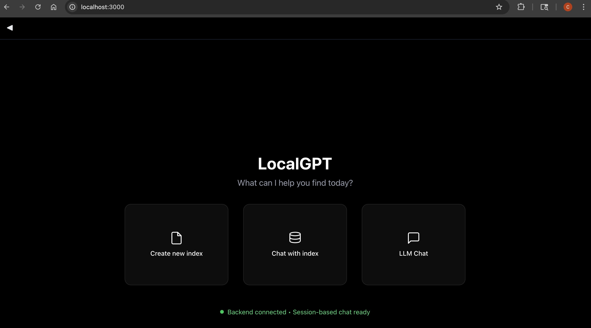

| Version | Updated on | Updated by |
| :--- | :--- | :--- |
| v1.0.0 | 10/01/2025 | @crxso |

## Install Ollama and Dependencies

This guide will walk you through installing **Ollama** to run large language models (LLMs) locally and then setting up and running **localGPT**, a system for local RAG (Retrieval-Augmented Generation).

###  Environment Setup

It's highly recommended to use a **Python virtual environment** to isolate project dependencies.

```bash
# Create a new virtual environment (e.g., named 'local-ai-env')
python3 -m venv local-ai-env

# Activate the virtual environment
source local-ai-env/bin/activate

# Your terminal prompt should now show the environment name (e.g., (local-ai-env))
````

###  Install Homebrew (Without Admin Privileges)

If you do not have **sudo** or admin privileges, you can install Homebrew by cloning the repository and adding it to your **PATH**.

```bash
# Clone the Homebrew repository into the 'brew' directory in your home folder (~/)
git clone [https://github.com/Homebrew/brew.git](https://github.com/Homebrew/brew.git) ~/brew

# Add Homebrew's binaries to your PATH for the current session
# This path matches your verified installation location.
export PATH="$HOME/brew/bin:$PATH"

# Add this line to your shell profile file (e.g., ~/.zshrc or ~/.bash_profile)
# for persistent access in new terminals.
# For example, for zsh:
echo 'export PATH="$HOME/brew/bin:$PATH"' >> ~/.zshrc

# Verify the installation
which brew
brew --prefix
# Expected output similar to:
# /Users/<user>/brew/bin/brew
# /Users/<user>/brew
```

###  Install Ollama and System Dependencies

Use Homebrew to install Ollama and the necessary C library **libmagic**.

```bash
# Install Ollama
brew install ollama

# Install System Dependencies: libmagic is required by the framework
brew install libmagic
```

###  Fix Library Linking (macOS Specific)

On macOS, you may need to set the `DYLD\_LIBRARY\_PATH` environment variable so Python can find the `libmagic` installation. The path now correctly reflects the `~/brew` structure.

```bash
# Set DYLD_LIBRARY_PATH for the current session
export DYLD_LIBRARY_PATH="$HOME/brew/lib:$DYLD_LIBRARY_PATH"

# Add this line to your shell profile for persistence.
# For example, for zsh:
# echo 'export DYLD_LIBRARY_PATH="$HOME/brew/lib:$DYLD_LIBRARY_PATH"' >> ~/.zshrc
```

-----

## Run Ollama Server and Download LLM

The Ollama server must be running to interact with models, and you need to download a model for localGPT to use.

###  Start the Ollama Server

The server must be running in the background. **Open a new terminal window** and run the following command.
* **Note:** This terminal must remain open.

```bash
ollama serve
```

###  Download LLM

Download a code-focused model, like `codellama:13b-instruct`, which offers a good balance of capability and performance for local machines.

```bash
ollama pull codellama:13b-instruct
```

You can verify the download by running:

```bash
ollama list
```

-----

## Setup and Run localGPT

localGPT is a project that uses Ollama and a vector database for local RAG functionality.

###  Clone and Prepare localGPT

In your **original terminal window** (the one with the activated virtual environment), clone the localGPT repository and install its dependencies.

```bash
# Clone the repository
git clone [https://github.com/PromtEngineer/localGPT.git](https://github.com/PromtEngineer/localGPT.git)
cd localGPT

# Install Python dependencies
pip install -r requirements.txt

# Key dependencies include: torch, transformers, lancedb, sentence_transformers, docling.
# Install Node.js dependencies (for the web interface)
npm install
```

###  Run localGPT

You already have the Ollama server running in a separate terminal. Now, start the localGPT application.

```bash
# Start the localGPT system
python run_system.py
```

###  Access the Application

Once the script is running, the localGPT web application will be accessible.

```bash
# Access the application
open http://localhost:3000
```

You can now use your local LLM with the localGPT interface\! 🎉



-----

## Final Cleanup

When you are finished, you can close the terminal running `ollama serve` to stop the server.
To exit the Python virtual environment in your other terminal:

```bash
deactivate
```